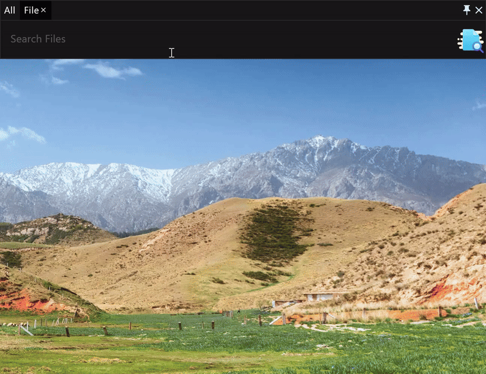
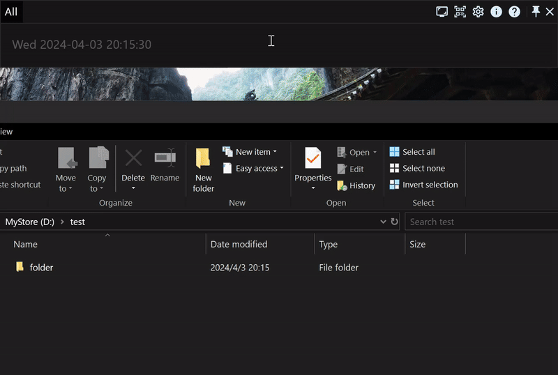

# The fully advanced manual of the productivity application RunFlow

Welcome to our advanced manual of the RunFlow, if you don't know RunFlow yet, we recommend you read our [fundamental manual](runflow_basic_point.md) first.

### Searching Files

Appending `len` parameter to filter files by size, such as: `len:1kb-2kb`, `len:3mb-5mb` etc.



> `**` can match multi-level directories. For an instance, finding files which start with `test` in the folder `folder_a`, we can input like this: `folder_a/**/test`.

### Calculator

We have two preset irrational numbers `e` and `pi`.


Calculating big numbers, if you want to calculate `9999999999999999999*9999999999999999999`, there is no result if you input it directly like this. We should append a `d` parameter after the number, like this: `9999999999999999999d*9999999999999999999d`.


### Unwrap Folder

Suppose we have a folder in the below example, and now we need to delete the folder and bring all the files to the same directory, the `folderunwrap` will be helpful.

```text
folder
├─text_01.txt
├─text_02.txt     
├─folder01
│ ├─text_03.txt
│ └─text_04.txt
└─folder02
  └─folder03
    ├─text_05.txt
    └─text_06.txt
```

After unwrap the folder, all the files at the same directory level:

```text
text_01.txt
text_02.txt
text_03.txt
text_04.txt
text_05.txt
text_06.txt
```



### Running in Separate Window


### Importing and Exporting Data

We support exporting data as JSON format, and importing data also needs to be the JSON format.

### Data Synchronization

##### Local Synchronized Service

The local-based synchronized service is our builtin function, which relies on third-party cloud service, such as Onedrive, iCloud, Google Drive and Dropbox, etc.

Here I use my usually used OneDrive as an example, the other cloud synchronization is the same. We can first create a new folder `MyFlow` in OneDrive to store the data that needs to be synchronized, and then open the settings page of data synchronization, turn on the `Data Sync Service Based On Local`, and set the folder where the data is located. 


> Telling you a secret, turning on the data synchronization service will enable you to synchronize your clipboard.

### Scheduled Tasks

In the settings page of hot events, we can use Cron expressions to set scheduled tasks, such as regularly cleaning the computer recycle bin, and recreating file indexes, etc.


Here is a brief explanation of the cron expression:

| second(0-59) | minute(0-59) | hour(0-23) | day-of-month(1-31) | month(1-12) | week(0-7, both 0 and 7 are sunday) | explanation                    |
|--------------|--------------|------------|--------------------|-------------|------------------------------------|--------------------------------|
| 0            | 0            | 12         | *                  | *           | *                                  | executing at 12:00 every day   |
| 0            | 0            | 12         | *                  | *           | 1                                  | executing at 12:00 every month |

> [Learn more information about cron](https://en.wikipedia.org/wiki/Cron).

### Thanks

Here is all about the commonly advanced builtin functions of RunFlow, if you need more functions, you can visit our [plugin store](https://myrest.top/store/plugin). If you are a developer, welcome to read our [developer manual](runflow_developer_point.md) and submit plugins.
