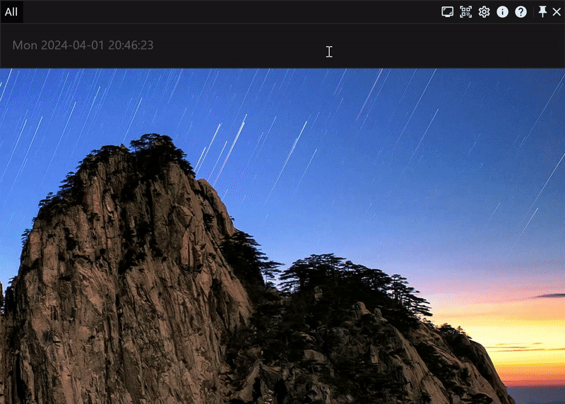
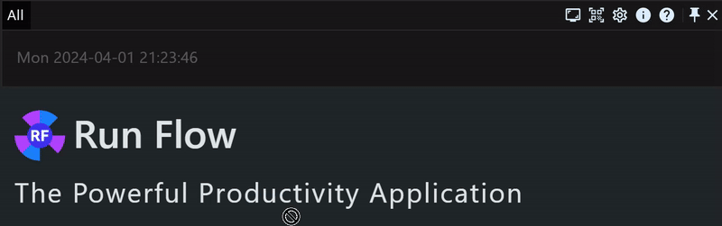
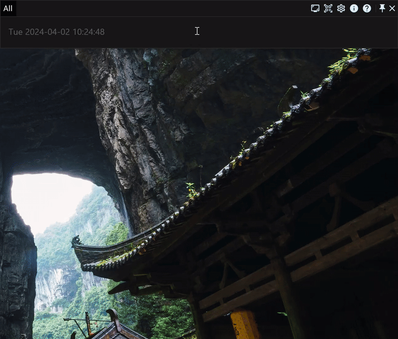
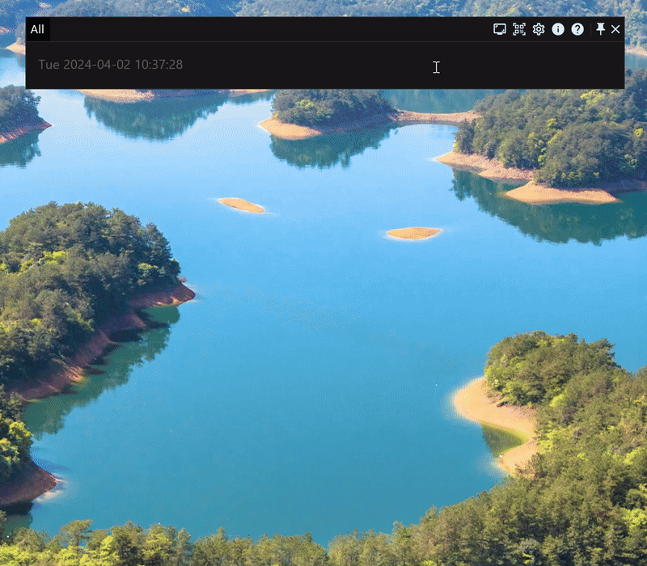
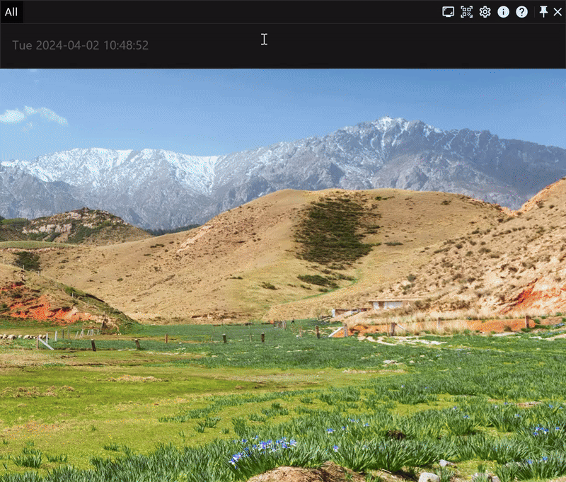
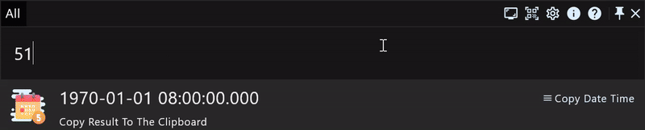

# The fully fundamental manual of the productivity application RunFlow

RunFlow is a new powerful productivity application developed by us. This article is the basic manual of the RunFlow's skills, and also for the function demonstrations. [If you want to know what new features we have, you can read this article](runflow_first_release.md), here is no details about this. Let's get started.

### Keyword

`Keyword` is our a main feature, a function usually consists of one or more keywords, and you can customize all of these keywords. If you don't like the default keyword, you can customize it with your preference. Then to trigger the function, we only need to type the associated keyword, which makes everything more efficiently.

### Download and Install

This is the prerequisite for experiencing RunFlow, there is not much to introduce, [**please click here to download and install**](https://myrest.top/myflow/download).

### Common Sense

In Windows, you can press the hotkey `Windows+Space` to show or hide our Action Window, and in macOS, you can press `Command+Space` to show or hide it.

The `Enter` key can be used to quickly execute the selected result.

The `Tab` key can quickly help us complete the input. It can directly let the suggested text or title which provided by the result as the input content, like the under example: jump to the plugin store.

### General Settings

Typing `settings general`, then press `Enter` to jump to General Settings page, which can set languages, themes and placeholders, etc.

### Control Your Computer

Typing `settings builtin` jump to Builtin Settings page to see what system commands we support.

| Keyword        | Function                                       |
|----------------|------------------------------------------------|
| `emptytrash`   | clean computer recycle bin                     |
| `lock`         | lock computer                                  |
| `restart`      | restart computer                               |
| `shutdown`     | shutdown computer                              |
| `sleep`        | sleep computer                                 |
| `screensaver`  | open system screen saver                       |
| `sleepdispaly` | sleep computer displays                        |
| `logout`       | logout computer                                |
| `taskviewer`   | open system task viewer (only Windows support) |
| `quit`         | quit applications                              |

 
Here, we use quiting applications as the demonstration:
  

### Dragging Input

Whether it is a file or text, you can input by dragging (ensure the Action Windows is pinned before dragging to avoid hiding it because lost focus, you can pin or unpin it by double-pressing the `Ctrl` key or clicking the pin button in the top right corner).

### Searching Files

find files (append `file` parameter to find files only)

preview files

find folders (append `dir` parameter to find folders only)

find applications (append `app` parameter to find applications only)

> `?` matches any single character, `*` matches any one or more characters.

### Calculator

We support basic mathematical arithmetic operations and remainder operations, as well as linear equations of one variable.

> `%` is the remainder operation.

### 剪贴板

剪贴板历史记录将记录您复制的文本、文件和图片。

搜索剪贴板（仅搜索文本）

打开剪贴板功能页（管理文本、文件和图片）

> 如果您没有安装中文插件，可以通过输入 `clipboard` 跳转到剪贴板页面。

### 二维码

### 自定义快捷键

我们支持两种类型的快捷键，一种是常规的组合快捷键，比如 `Ctrl+C`，另一种是多次点击某一个按键，比如上面提到切换窗口固定状态的双击 `Ctrl`，我们将其标记为 `Ctrl*2`，当然您也完全可以根据您的喜好修改为 `Alt*2`，甚至 `Ctrl*3` 都是可以的。

打开热点事件设置页面，来自定义快捷键吧。这里我们将默认切换工作窗口显示状态和固定状态的 `Windows+Space` 和 `Ctrl*2` 分别改为 `Ctrl+Space` 和 `Alt*2` 作为演示，在实际使用中，您完全可以修改为其他快捷键，您还可以为其他功能设置快捷键。

### 自定义触发角

触发角是非常好用的一个功能，当您将鼠标移动至屏幕边缘时，就可以触发该功能，这里我们将演示当鼠标移至右上角时打开任务视图，以及将鼠标移至右下角时锁屏。

### 固定关键字

在默认的选项卡 `全部` 中会查找所有的关键字，然后将结果汇总展示出来，但是这会有数量的限制。如果您仅想执行某一个关键字的功能，不想受到其他关键字的干扰，或者需要查看更多的搜索结果，那么您需要固定关键字，比如查找文件。

### 计时器

支持正计时和倒计时（您可以通过回车或鼠标双击保存倒计时）

### 文件批量重命名

当您需要对一堆文件按指定格式命名时，这个小工具或许能解决您的烦恼，批量重命名文件支持格式化、替换文本，以及插入和追加文本。

### 结语

好了，RunFlow手册的基础篇就介绍到这里，希望本工具对您有帮助。如果您还想了解更多，那我们进阶篇见。
