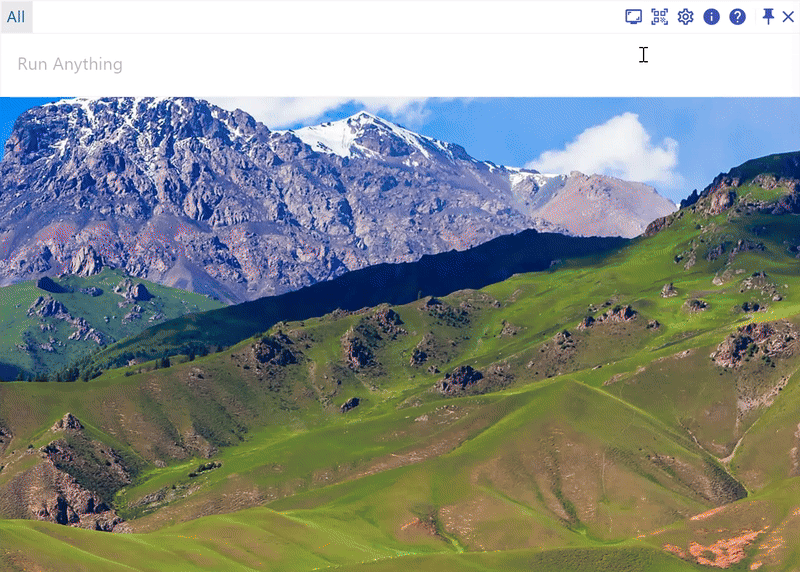
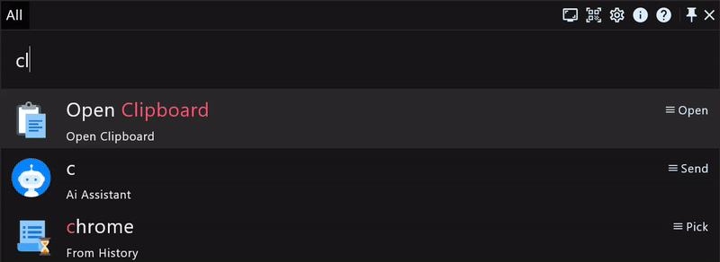

# The fully fundamental manual of the productivity application RunFlow

RunFlow is a new powerful productivity application developed by us. This article is the basic manual of the RunFlow's skills, and also for the function demonstrations. [If you want to know what new features we have, you can read this article](runflow_first_release.md), here is no details about this. Let's get started.

### Keyword

`Keyword` is our a main feature, a function usually consists of one or more keywords, and you can customize all of these keywords. If you don't like the default keyword, you can customize it with your preference. Then to trigger the function, we only need to type the associated keyword, that makes everything more efficiently.

### Downloading and Installation

This is the prerequisite for experiencing RunFlow, there is not much to introduce, [**please click here to download and install**](https://myrest.top/myflow/download).

### Common Sense

In Windows, you can press the hotkey `Windows+Space` to show or hide our Action Window, and in macOS, you can press `Command+Space` to show or hide it.

The `Enter` key can be used to quickly execute the selected result.

The `Alt` key can popup the context menu or refreshes the result.

The `Tab` key can quickly help us complete the input. It can directly let the suggested text or title which provided by the result as the input content, like the under example: jump to the plugin store.

### General Settings

Typing `settings general`, then press `Enter` to jump to General Settings page, which can set languages, themes and placeholders, etc.

### Controlling Your Computer

Typing `settings builtin` jump to Builtin Settings page to see what system commands we support.

| Keyword        | Function                                       |
|----------------|------------------------------------------------|
| `emptytrash`   | clean computer recycle bin                     |
| `lock`         | lock computer                                  |
| `restart`      | restart computer                               |
| `shutdown`     | shutdown computer                              |
| `sleep`        | sleep computer                                 |
| `screensaver`  | open system screen saver                       |
| `sleepdispaly` | sleep computer displays                        |
| `logout`       | logout computer                                |
| `taskviewer`   | open system task viewer (only Windows support) |
| `quit`         | quit applications                              |

 
Here, we use quiting applications as the demonstration:
  

### Dragging Input

Whether it is a file or text, you can input by dragging (ensure the Action Windows is pinned before dragging to avoid hiding it because lost focus, you can pin or unpin it by double-pressing the `Ctrl` key or clicking the pin button in the top right corner).

### Searching Files

find files (append `file` parameter to find files only)

preview files

find folders (append `dir` parameter to find folders only)

find applications (append `app` parameter to find applications only)

> `?` matches any single character, `*` matches any one or more characters.

### Calculator

We support basic mathematical arithmetic operations and remainder operations, as well as linear equations of one variable.

> `%` is the remainder operation.

### Clipboards

Clipboards will save you copied text, files and images.

find clipboard (only text)

open clipboard func page (manage texts, files and images)

### QRCode

### Customizing Hotkey

We support two types of shortcut keys, one is the regular combined hotkeys, such as `Windows+Space`. And the another type is to click a certain key multiple times, such as double-pressing `Ctrl` mentioned above to toggle the pinned state of the Action Window, we mark it as `Ctrl*2`, of course you can also change it to `Alt*2` or even `Ctrl*3` or any other hotkeys according to your preference.

Open the settings page of hot event to customize the hotkeys. Here we change the default `Windows+Space` and `Ctrl*2` to `Ctrl+Space` and `Alt*2` that toggle the Action Window visible state and the pinned state respectively as a demonstration. In actually experience, you can change to any other you liked hotkeys, and also set hotkey for other functions.

### Customizing Hot Corner

The hot corner is a very useful feature, it can be triggered when you move the mouse to the edge of the screen. Here we will demonstrate you open task viewer when the mouse moves to the top right corner and lock screen when the mouse moves to the bottom right corner.

### Pining Keyword

In the default tab `All`, all keywords will be queried and the results will be aggregated displayed, but here has a size limitation. If you wish to focus on a specified keyword to avoid be disturbed by others, or want to see more results, you may need to pin the keyword, such as finding files.

### Timer

supports positive timing and negative timing (you can save the negative timing by pressing `Enter` or double-clicking the mouse)

### Batch Renaming Files

When you want to rename a series of files in a fixed format, this function maybe able to solve your troubles. Batch renaming files supports formatting, replacing, inserting and appending text.

### Thanks

Okay, that's all the RunFlow fundamental manual, hoping this app will be helpful for you. If you wish to know more, let's see you in the [advanced manual](runflow_advanced_point.md).
