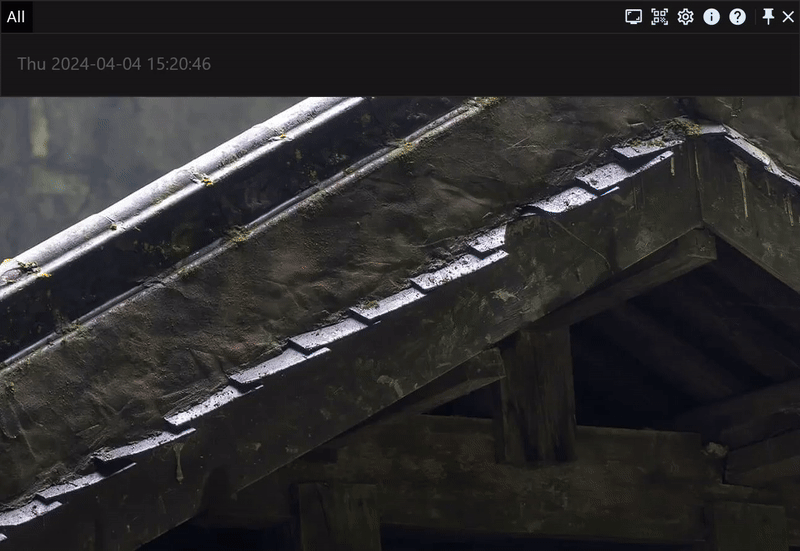
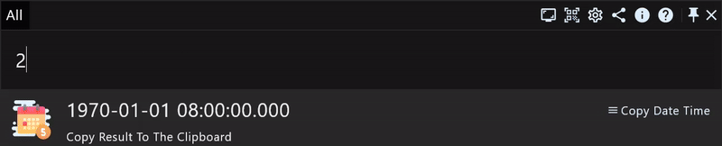
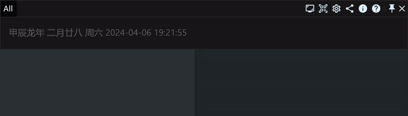

# The full developer manual of productivity application RunFlow

Earlier we introduced the [basic](runflow_basic_point.md) and [advanced](runflow_advanced_point.md) functions of RunFlow, this article is a developer manual specially prepared for developers. Let's take a look at the practical functions.

### Executing Commands

type `>` to enter the focused mode of command (supports recording history to make it faster to execute daily used commands):

### Calculator

base conversion (binary, octal and hexadecimal start with `0b`, `0`, `0x` respectively)

bit operations (and `&`, or `|`, XOR `^`, right shift `>>`, left shift `<<`)

### Datetime Calculator

current timestamp (add a `.` parameter to stop the real time, ie: `now.`)

timestamp to datetime (year, month, day, week, hour, minute, second millisecond are represented by `y`, `m`, `d`, `w`, `h`, `min`, `s`, `ms` respectively)

offset calculation (`<` offset to the past, `>` offset to the future, examples: offset to the end of this week `now>w`, offset to the beginning of this month `now<m`, offset to the end of a certain day `2024-05-01>d`)

addition and subtraction for datetime calculation (examples: `100y+500h+999ms`、`2024-05-01+999min-3w`)

calculate the difference in days between two date (the datetime format at both ends must be consistent, examples: `2024-07-01-2024-01-01`、`20241231-20231231`)

> Supported formats for datetime: `yyyymmdd`、`yyyy-mm-dd`、`yyyyMMddHHmmss`、`yyyyMMdd HHmmss`、`yyyyMMddHHmmssSSS`、`yyyyMMdd HHmmssSSS`、`yyyy-MM-dd HH:mm:ss`、`yyyy-MM-dd HH:mm:ss.SSS`.

### Random Generator

Examples: `random abc 16` random 16 lowercase and uppercase letters, `random abc upper 16` random 16 uppercase letters, `random abc lower 16` random 16 lowercase letters, `random int 100,999` a random number from 100 to 999, `random color` a random color.

### Developer Tools

We also provided a developer tools plugin, that include functions: coding naming style conversion, color parsing, CRON expression parsing, Base32 and Base64 encoding and decoding, Sha256 and MD5 encryption, UUID generator, letter uppercase and lowercase conversion, etc. [The Plugin Documentation](https://myrest.top/store/plugin?id=top.myrest.myflow.developer).

### Thanks

This article introduces some commonly used functions by developers. If you wish to develop plugins, welcome to read our [plugin development guide](https://myrest.top/guide/myflow/plugin). If you are a Java developer, we have also prepared a [Java developer manual](runflow_java_developer_point.md), welcome to read it.
