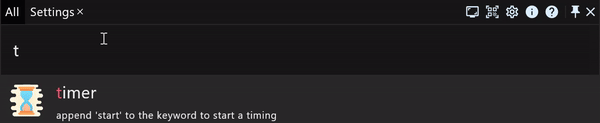
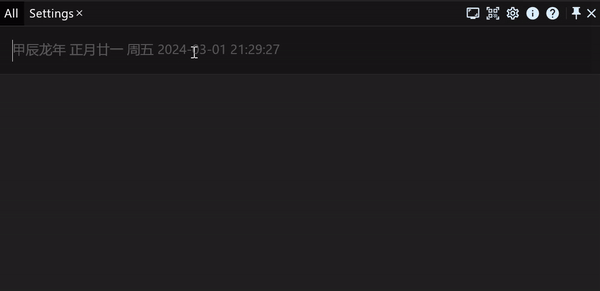

# We are happy to announce the first release of RunFlow, the new powerful productivity app

[**RunFlow**](https://myrest.top/myflow) is a cross-platform productivity tool which can launch apps and search files and more, that similar to [Wox](https://github.com/Wox-launcher/Wox) and [PowerToys](https://github.com/microsoft/PowerToys) on Windows, and also similar like [Alfred](https://www.alfredapp.com) and [Raycast](https://www.raycast.com) on macOS. But we have differences with these tools, and we have our own unique new features. Right now, at the below, we will introduce you what features of RunFlow have been implemented in more details. It's an amazing journey, let's start.

### Cross Platform

The first main feature is cross-platform. Let you have a unified UI and operation experience when working cross-platform, do not need to switch tools.

> But Unfortunately for Linux users, the first edition of RunFlow have some fatal problems on Linux, so, currently, Linux is not supported yet. But we will try more efforts to fix these problems to make RunFlow working fine on Linux, and Linux will get support eventually.

### Multiple Languages

RunFlow support multiple languages, but by default, we only have english and simplified chinese. If you prefer to other languages, you can go to our [plugin store](https://myrest.top/store/plugin?query=language) to find a language translator, after you installed the plugin, you can choose your preferred language.

### Customizable Style and Theme

Here we want to introduce you one of our design philosophy is that we allow user to highly customize most things, so we allow plugin to provide one or more window style and theme, to let you choose what you preferred.

### Triggered by Keyword

In RunFlow, a function must be provided by keyword, unless some specials, such as language translator, theme provider and data sync service, etc. So likewise, a new keyword always mean a new function, and most of the plugins you installed also consist by keywords.

To use the function of the keyword, the most commonly way is just typing the keyword, if the function don't need any arguments, you can see the result row at the below, then to execute the result you can press `Enter` (ensure the result row is at the front, if not, you should press `Up` or `Down` to active it, or move mouse to hover on it) or double-click the result row.

If the function need one or more arguments, you should type a whitespace to separate the keyword and argument (multiple arguments also use whitespace to separate). For example, typing `timer start` to start a timer, the `timer` is a keyword, the `start` is an argument.

However, if you input `start timer` is also work, in this case, `timer` is still the keyword, `start` is also still the argument, why this situation is ok?

Because we support the **`postfixed matching`**, this feature allow you input the arguments first, input the keyword at last, this will be useful in some cases. For example, if you want to encode some literal by base64, you copied or dragged or typed the text as the argument first, but you forgot to type the keyword `base64` at the front, if we don't have the **`postfixed matching`** feature, you must move cursor to the front, then type keyword `base64` and a whitespace to separate keyword and argument, fortunately, we have, you just need to append the keyword after the text (also need a whitespace to separate), such as `myrest.top base64` to encode text `myrest.top` by base64.

The most useful of the **`postfixed`** feature is for **`special keyword`**. **When a keyword starts with symbol not letter or digit, we mark it as a special keyword, and when a special keyword work with `postfixed` feature, we no longer need to use a whitespace to separate the keyword and the argument.**

Right now, let's see an example about the special keyword `/` that was provided by our plugin [Ai Assistant](https://myrest.top/store/plugin?id=top.myrest.myflow.ai), it can chat with AI, such as ChatGPT. This is very useful when you want to ask some questions, then just type the keyword to trigger the function.

> The keyword `base64` and `/` mentioned above are not builtin functions, you can find keyword [`base64`](https://myrest.top/store/plugin?query=base64) and [`/`](https://myrest.top/store/plugin?query=/) in plugin store.

> Don't worry about all of these keywords you may think you should remember them, we have a keyword suggestion function that can infer what you want to do by prefix matching. So you don't need to remember keywords, our `suggestion` will help you.

### Refreshable Result

Through the above examples, you have seen our UI of the result can be refreshed in real time. Let's see another example about the refreshable result: type keyword `random` to obtain a random string, that returned result is static and immutable, but if the result is unsatisfied to you, you can press `Alt` to refresh it to get a new random string or click `refresh` button on the right side.

### Context Menu of Result

Context menu of result, we also call it `Result Callback Extension`. Like you find files in file browser, you can right-click on file, then pop a context menu that show multiple operations. So RunFlow also do it, but not just for files, any other types can also have context menu. And in RunFlow, we use `Alt` key instead of right-click to pop the dialog.

Let's show you an example by a file, we press `Alt` to pop the context menu, and then you can press `Up` or `Down` to select to you preferred item, then press `Enter` to execute it, or use mouse double-click it.

We also want to show you another way to present the context menu, only need move the mouse to hover the `context menu` icon on the right side. Let's look a sample.

### Toolbar

A toolbar, that can quickly access functions for your daily usage. In the above examples, you have seen toolbar at the top right. You can customize toolbar at **General Settings** page.

### Pinned Keyword

After pinned a keyword, we will create a new tab to display the keyword, working under this tab, you no longer to type the keyword, and you do not be disturbed by other keywords.

### Interoperable UI

The earlier mentioned examples are interactive with a textfield, but if we have much more complex logics and need more user inputs, how to do that? Luckily, we have a feature we call it `Func Page`, so don't worry about the complicated interaction, like our `file batch rename`.

### Separate Window

If you don't like multiple tabs on our action window, or you don't want to switch between multiple tabs. You can right-click the tab name, then you will see a popped button `Run In Separate  Window`, like this after you executed it.

### Hot Event

Hot event is another quickly way to trigger a function of keyword. Currently, we support hot corner, mouse long click event, hotkey and cron expression, you can customize all of these hot events to trigger what functions you want to execute.

### Focused Mode

Focused mode is different from pinned keyword, that do not create a new tab, but the same point is they are both don't be disturbed by other keywords. Another point is, focused mode usually required developer to do some additional jobs.

Let's see a commandline example in focused mode (triggered by keyword `>`).

### Data Security and Synchronization

Your data is encrypted and stored locally, we do not upload your data to any clouds. So you do not about the issues about data security.

But if you want to synchronize these data across platforms, it will be a little tedious by our default implementation, see [how to synchronize data](https://myrest.top/guide/myflow/user#/?id=sync-data).

### Plugins

We support extending RunFlow functionalities through plugins, and our requirements for plugins are very loosely. So plugin can do much more complicated things, giving plugin unlimited possibilities.

We have a builtin plugin that bundled with RunFlow, that provide many common functions, learn more about our [builtin plugin](https://myrest.top/store/plugin?id=top.myrest.myflow.builtin).

### Developing Plugin

Here, we want to say something to developers. 

To develop a RunFlow plugin is very simple, there is no limitation for programming languages. But because RunFlow is built on Compose Multiplatform which powered by JetBrains, so it would be better if you familiar with Java and Kotlin.

We welcome developers to develop and submit plugins, please see our [plugin guide](https://myrest.top/guide/myflow/plugin).

### Thanks

Thanks for your patience to read this article, if you feel this tool is helpful to you, please help us to spread it, we need your publicity, thanks again.

See our [product page](https://myrest.top/myflow), and you can download RunFlow by this [**link**](https://myrest.top/myflow/download).

If you have any problems, please feel free to give us a feedback, we would love to hear from you.

Regards,
The MyRest Team
