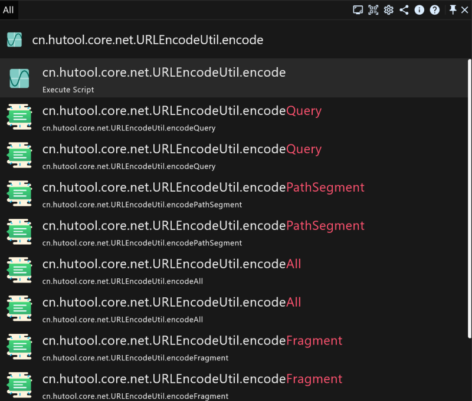

# The full Java developer manual of the productivity application RunFlow

This manual is writing for Java developers, if you are not a Java developer, you can read our [developer manual](runflow_developer_point.md). Of course, you can continue reading if you are interested.

> Typing `qe` to enter the focused mode of QLExpress.

### Executing Java Code

for math example: `Math.sin(9);`

> Running result: `0.4121184852417566`.

for reading system environment variables example: `top.myrest.myflow.util.Jackson.INSTANCE.toJsonString(System.getenv(), true);`

> Of course, you can also format it as yaml: `top.myrest.myflow.util.Jackson.INSTANCE.toYamlString(System.getenv());`.

### Verifying Methods

Sometimes, because some tooling classes have so many methods, and you are not sure which one to use, so we need to verify the execution result of the method, for example:

### Thanks

`QLEpress` brings you the ability to execute Java code at RunFlow runtime, we support execute script file which written by QLExpress syntax, [click here to learn QLExpress syntax](https://github.com/alibaba/QLExpress). 

Meanwhile, we support develop plugin through QLExpress, [click here to learn how to develop plugin with QLExpress](https://myrest.top/guide/myflow/plugin#/general-plugin-guide/general_guide?id=general-plugin-guide). Certainly, you will get better interaction capabilities if you use Java to develop plugins, [welcome to click here to read our Java guide](https://myrest.top/guide/myflow/plugin#/jar-plugin-guide/jar_guide?id=jar-plugin-guide).
