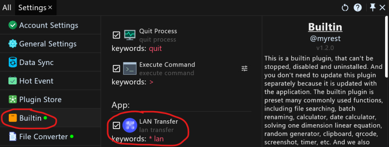
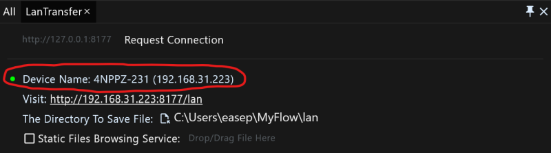
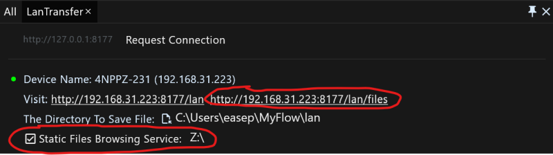
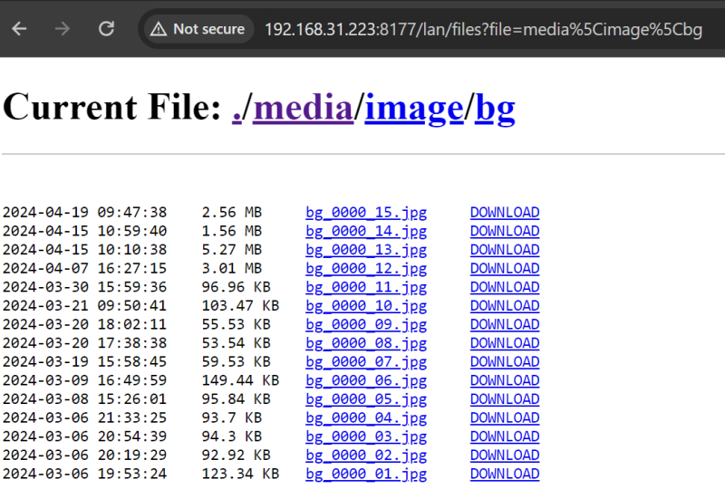
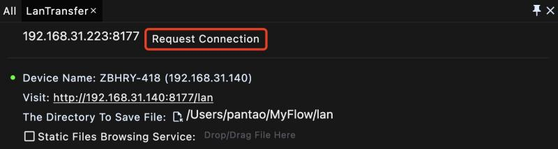
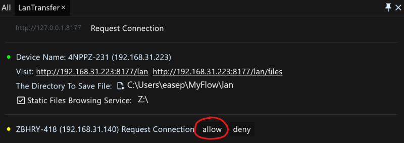
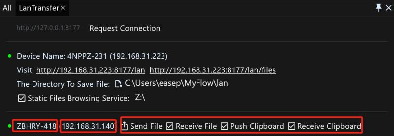
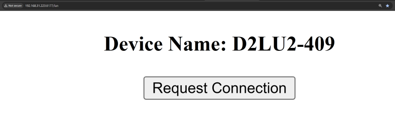
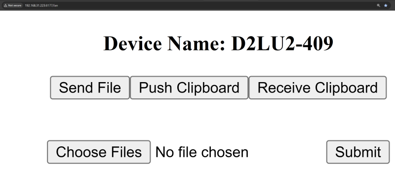

# The LAN transmission manual of productivity application RunFlow

This article will show you how to use RunFlow to transfer files and synchronize the clipboard within a local area network (LAN). Whether it is a home LAN or an office LAN, you can easily transfer files and synchronize the clipboard. If you have not installed [RunFlow](https://myrest.top/myflow) yet, [you can click here to download it](https://myrest.top/myflow/download).

> Why is it recommended to use LAN transmission? 1. Private, files and clipboard are transmitted within your intranet and will not be connected to any public network server, ensuring the privacy and security of your data; 2. Fast, precisely because it is transmitted within the intranet, no need to Internet environment, so the transmission can be faster.

### Enabling LAN Transfer

The LAN transfer tool is not enabled by default. To enable it, we need to jump to the settings page of the builtin plugin, scroll down, and you will see a function called `LAN Transfer`, check it to enable LAN transfer.

> If you still don't know how to open our settings page, you can start with our [basic manual](runflow_basic_point.md).

After successfully enabling `LAN transfer`, enter `lan` to open the function page, the interface is as follows:

> The small green dot on the left side of the device name indicates that the service started successfully, otherwise it indicates that the startup failed. The reason for the failure is most likely that the port is occupied. It is recommended that you modify the Http port on the `General Settings` page and restart the application.

### Static Files Browsing Service

The static files browsing service can be understood as you sharing a read-only file, and other users on the same network can browse and download the file you shared. To enable the static files browsing service, first we need to check it and set a file (usually a folder) to be shared. After the setting is successfully, we can see an accessible link and open the link with a browser to browse and download files.

> This solution can transfer files to other devices that do not have RunFlow installed, such as mobile or Linux devices.

### Request a Connection to Transfer Files and Clipboard

To request a connection, we first need know the IPv4 address of the other device and the port where RunFlow starts the HTTP service. In the second demonstrate image above, you can see that our interface has displayed the IPv4 address and port of the current device: `192.168.31.223:8177`.

device A requests connection to device B:

device B allows the connection (of course you can deny it):

After allowing the connection, we can see the opposite's device name and IPv4 address, and set the relevant permissions (all turned on by default, you can customize it: 1. receive files, whether to receive files from the device; 2. push clipboard, when the clipboard changes, whether to push the clipboard to the device; 3. receive clipboard, whether to receive the clipboard pushed from the device).

> After allowing the connection, you can happily transfer files and synchronize the clipboard (text, images and files can all be synchronized).

### Request Connections with Mobile/Web or Other Devices That Do Not Have RunFlow Installed

In the second demonstrate image about, you can see that we displayed an accessible link: `http://192.168.31.223:8177/lan`, through this link we can let the browser connect to RunFlow.

> Note some limitations of requesting a connection through the browser: 1. unable to receive files; 2. unable to listen the changes of the clipboard, so pushing the clipboard is your manual behaviour; 3. unable to receive clipboard pushes from the device, but we can see the current clipboard content of the device.

### Thanks

This article introduces you how to use the LAN transfer tools we provide to transfer files and synchronize the clipboard to meet the transmission of various private data.
