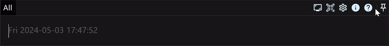
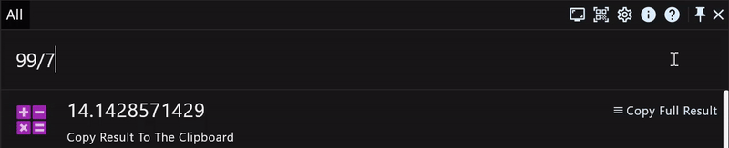
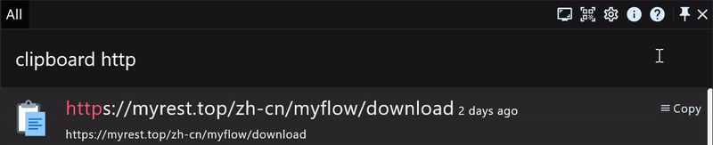
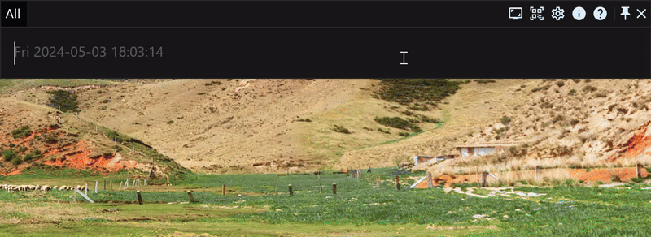

# Take stock of the easily overlooked functions of productivity application RunFlow

In this article, we will show you some functions which are easily overlooked but very practical of RunFlow.

> Don't Know about RunFlow yet? [Start learning here](runflow_basic_point.md).

### Pin Action Window

> You can also toggle the window pinned state by double-clicking the `Ctrl` key, you can also customize this shortcut key on the `Hot Event` settings page.

### Preview The Result of The Menu

### Open The Copied URL From Your Clipboard In Your Browser

### Input Multiple Lines

> Press `Ctrl+Enter` or `Shift+Enter` to start a new line.

### Pin Result

> Pinned results will always display at the front of the list.

### Thanks

This article takes stock of those functions that are easily overlooked but are very useful.
