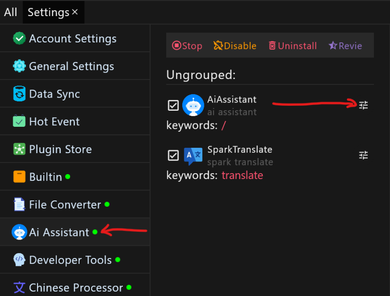
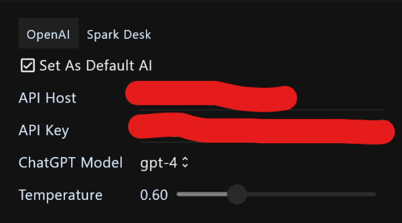
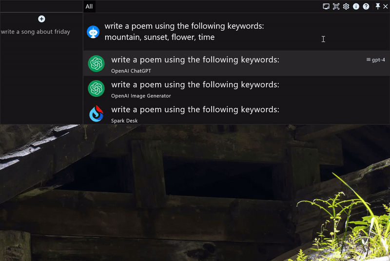

# The manual of plugin AI assistant for productivity application RunFlow

This article will introduce you the detailed usage about the plugin AI assistant of RunFlow. If you didn't know RunFlow yet, we recommend you read our [basic](runflow_basic_point.md) and [advanced](runflow_advanced_point.md) manuals first.

### Installation

Goto **Settings** -> **Plugin Store**, then installing **Ai Assistant** plugin.

### Configuring OpenAI

Apply an API Key：[click here to apply an API Key from the OpenAI official website](https://platform.openai.com/account/api-keys), we also support API Keys  from third-party agents (because some countries or regions cannot use OpenAI services).

goto `Ai assistant` settings:

Configure `API Key`

> If you cannot access the OpenAI service or applied a third-party API Key, you can set the `API Host` (proxy server).

### Single Conversation

Input the question you want to ask the AI assistant, and then type the keyword `/`:

### Continuous Conversation

Type the keyword `/` to enter the focused mode of AI assistant, to start a continuous conversation.

> In this case, we will save your consultation records locally so that you can quickly input it next time.

### Conversation Management

Type the keyword `/` to enter the focused mode of AI assistant to manage conversations. On the left side of the Action Window, you can search for historical conversations, view historical conversations (you can also continue the conversation based on historical conversation), remove historical conversations, and click the plus button to start a new conversation.

### Thanks

This article shows you how to use the AI assistant plugin we provided, for more plugins please visit our [plugin store](https://myrest.top/store/plugin).
