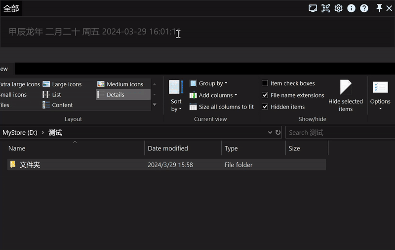

# 效率工具RunFlow完全手册之进阶篇

欢迎来到RunFlow手册的进阶篇，如果您还不了解RunFlow，建议先阅读我们的[基础篇](runflow_basic_point.md)。

### 搜索文件

按文件大小过滤，添加 `len` 参数，比如：`len:1kb-2kb`，`len:3mb-5mb` 等等。


> `**` 可以匹配多级目录，比如您想查找文件夹 `folder_a` 里面以 `test` 开头的文件，可以这样输入：`folder_a/**/test`。

### 计算器

我们内置了两个无理数 `e` 和 `pi`（圆周率π)。 


计算超大数，如果您想计算 `9999999999999999999*9999999999999999999`，直接这样输入是没有结果的，我们需要在数字后面添加一个 `d` 参数，像这样：`9999999999999999999d*9999999999999999999d`。


### 解散文件夹

假设我们有下方示例的一个文件夹，现在我们需要删除文件夹，把所有文件提到同一级，我们就可以使用 `folderunwrap`。

```text
文件夹
├─文本文件_01.txt
├─文本文件_02.txt
├─文件夹01
│ ├─文本文件_03.txt
│ └─文本文件_04.txt
└─文件夹02
  └─文件夹03
    ├─文本文件_05.txt
    └─文本文件_06.txt
```

解散文件夹后都在同一个目录级别：

```text
文本文件_01.txt
文本文件_02.txt
文本文件_03.txt
文本文件_04.txt
文本文件_05.txt
文本文件_06.txt
```



### 独立窗口运行


### 导入导出数据

我们支持导出JSON格式的数据，同样导入数据也需要是JSON格式的。

### 数据同步

##### 本地同步服务

基于本地的同步服务是我们内置的功能，它依赖于第三方的云盘服务，比如OneDrive、iCloud、Google Drive、小米云盘、百度云盘、阿里云盘等等。

这里我以我常用的OneDrive作为示例，其他云盘的同步方法也都一样，我们可以先在OneDrive中新建一个 `MyFlow` 的文件夹用来存储需要同步的数据，然后打开RunFlow数据同步的设置页面，开启 `基于本地的数据同步服务`，并设置数据所在文件夹即可。


> 偷偷告诉你，开启数据同步服务可以同步剪贴板。

### 定时任务

在热点事件的设置页面中，我们可以通过Cron表达式来设置定时任务，比如定时清理电脑垃圾回收站、定期重建文件索引等等。


这里简单解释一下上面的Cron表达式：

| 秒(0-59) | 分(0-59) | 时(0-23) | 天(1-31) | 月份(1-12) | 星期(0-7, 0和7都是星期天) | 说明          |
|---------|---------|---------|---------|----------|-------------------|-------------|
| 0       | 0       | 12      | *       | *        | *                 | 每天中午的12点执行  |
| 0       | 0       | 12      | *       | *        | 1                 | 每周一的中午12点执行 |

<br/>

> 了解等多Cron表达式，可以[点击这里](https://baike.baidu.com/item/cron)。

### 结语

本工具内置常见的进阶功能就介绍到这里了，如果您还想了解更多功能，可以到我们的[插件商店](https://myrest.top/zh-cn/store/plugin)看看，如果您是一名开发者，欢迎阅读我们的开发者篇手册，也欢迎您来提交插件。
