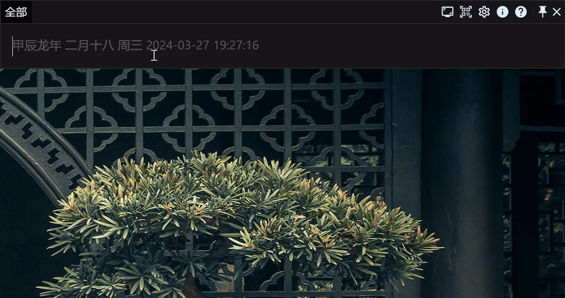
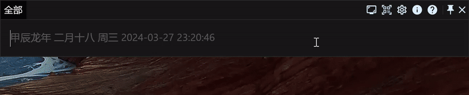
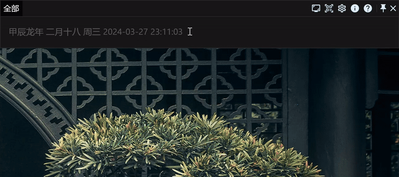
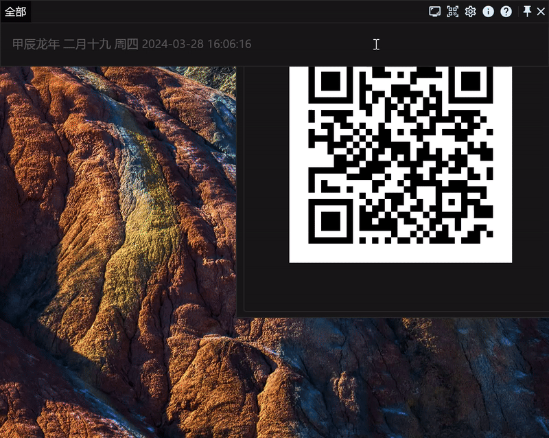
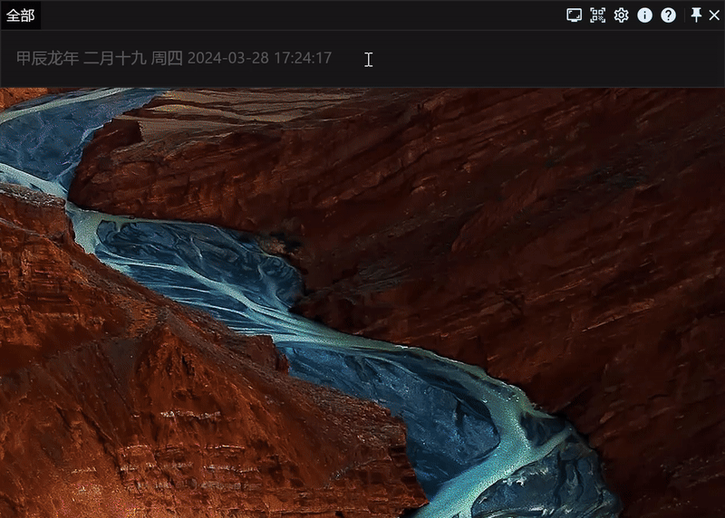
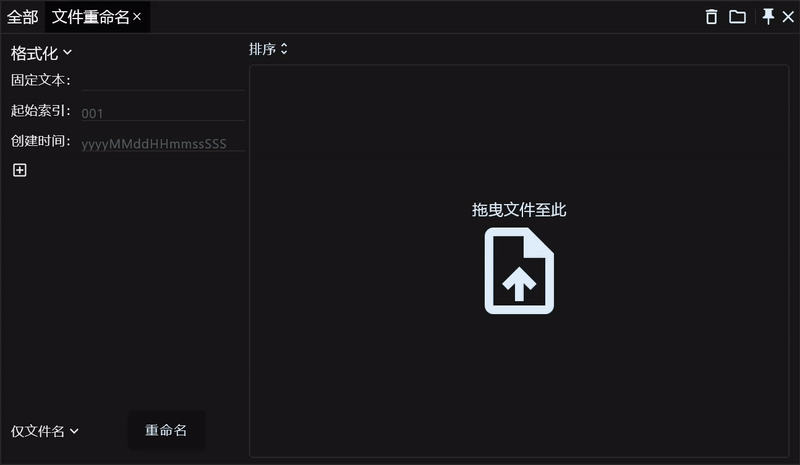

# 效率工具RunFlow完全手册之基础篇

RunFlow是我们开发的一款全新的效率工具，本文作为RunFlow操作手册和功能演示的基础篇，[想了解我们有哪些新特性可以阅读我们的这篇文章](runflow_first_release.md)，这里就不过多赘述了，我们直接开始。

### 关键字

关键字是我们的一个核心概念，一个功能通常由一个或多个关键字构成，并且所有的这些关键字您都可以自定义，如果您不喜欢默认的关键字您完全可以自定义它，然后我们只需要输入对应的关键字就可以触发该功能，这让一切变得更高效。

### 下载与安装

这是体验RunFlow的前置条件，没有太多需要介绍的，[**请点击这里完成下载并安装**](https://myrest.top/zh-cn/myflow/download)。

### 常识

在Windows中您可以按快捷键 `Windows+空格` 来显示或隐藏我们的窗口，在MacOS中您可以按 `Command+空格` 来显示或隐藏。

`Enter` 键可以用来快速执行选中的结果。

`Tab` 可以快速帮我们完成输入，它可以将结果提供的建议文本或标题直接作为内容进行输入，比如下面的插件商店跳转。

### 安装中文插件

安装中文插件后可以通过中文和拼音（支持全拼和首字母）来匹配关键字，这对习惯中文的用户来说相当友好，我们建议您安装。

### 常规设置

`设置` 是我们内置的功能，它的关键字是 `settings`，但是由于上面我们安装了中文插件，这里我们就可以通过中文或拼音来匹配跳转了，比如：`设置 通用` 或 `sz ty`。

跳转到通用设置页面后，可以设置语言，主题，占位符等等，这里我们建议开启开机自启。

> 如果您没有安装中文插件，可以通过输入 `settings general` 并回车直接跳转到通用设置页面。

### 控制电脑

输入 `sz nz` 跳转到我们内置功能的设置页面看看我们支持了哪些系统命令。

| 功能名称             | 关键字            | 中文或拼音匹配示例               |
|------------------|----------------|-------------------------|
| 清空电脑回收站          | `emptytrash`   | `清空`, `qingkong`, `hsz` |
| 锁定电脑             | `lock`         | `锁定`, `suoding`, `sddn` |
| 重启电脑             | `restart`      | `重启`, `qdn`             |
| 关闭电脑             | `shutdown`     | `关闭`, `gbdn`            |
| 休眠电脑             | `sleep`        | `休眠`, `xiumian`         |
| 屏幕保护程序           | `screensaver`  | `屏幕`, `pingmu`          |
| 休眠显示器            | `sleepdispaly` | `休眠`,`xsq`              |
| 登出电脑             | `logout`       | `登出`,`dcdn`             |
| 任务视图（仅Windows支持） | `taskviewer`   | `任务`, `renwu`           |
| 退出应用程序           | `quit`         | `退出`, `tc`              |

 
这里我们以退出应用程序作为演示：
  

> 如果您没有安装中文插件，可以通过输入 `settings builtin` 并回车直接跳转到内置功能设置页面。

### 拖拽输入

不管是文件还是文本，您都可以通过拖拽的方式输入（拖拽前需要先固定住我们的窗口，避免失去焦点而隐藏，您可以通过双击 `Ctrl` 键或点击右上角的固定按钮来固定或取消固定窗口）。

### 搜索文件

查找文件（添加 `file` 参数仅查找文件）

预览文件

查找文件夹（添加 `dir` 参数仅查找文件夹）

查找应用程序（添加 `app` 参数仅查找应用程序）

> `?` 匹配任意单个字符，`*` 匹配任意一个或多个字符。

### 计算器

支持数学四则运算和取余运行，以及一元一次方程。

> `%` 为取余运算。

### 剪贴板

剪贴板历史记录将记录您复制的文本、文件和图片。

搜索剪贴板（仅搜索文本）

打开剪贴板功能页（管理文本、文件和图片）

> 如果您没有安装中文插件，可以通过输入 `clipboard` 跳转到剪贴板页面。

### 二维码

### 自定义快捷键

我们支持两种类型的快捷键，一种是常规的组合快捷键，比如 `Ctrl+C`，另一种是多次点击某一个按键，比如上面提到切换窗口固定状态的双击 `Ctrl`，我们将其标记为 `Ctrl*2`，当然您也完全可以根据您的喜好修改为 `Alt*2`，甚至 `Ctrl*3` 都是可以的。

打开热点事件设置页面，来自定义快捷键吧。这里我们将默认切换工作窗口显示状态和固定状态的 `Windows+Space` 和 `Ctrl*2` 分别改为 `Ctrl+Space` 和 `Alt*2` 作为演示，在实际使用中，您完全可以修改为其他快捷键，您还可以为其他功能设置快捷键。

### 自定义触发角

触发角是非常好用的一个功能，当您将鼠标移动至屏幕边缘时，就可以触发该功能，这里我们将演示当鼠标移至右上角时打开任务视图，以及将鼠标移至右下角时锁屏。

### 固定关键字

在默认的选项卡 `全部` 中会查找所有的关键字，然后将结果汇总展示出来，但是这会有数量的限制。如果您仅想执行某一个关键字的功能，不想受到其他关键字的干扰，或者需要查看更多的搜索结果，那么您需要固定关键字，比如查找文件。

### 计时器

支持正计时和倒计时（您可以通过回车或鼠标双击保存倒计时）

### 文件批量重命名

当您需要对一堆文件按指定格式命名时，这个小工具或许能解决您的烦恼，批量重命名文件支持格式化、替换文本，以及插入和追加文本。

### 结语

好了，RunFlow手册的基础篇就介绍到这里，希望本工具对您有帮助。如果您还想了解更多，那我们进阶篇见。
