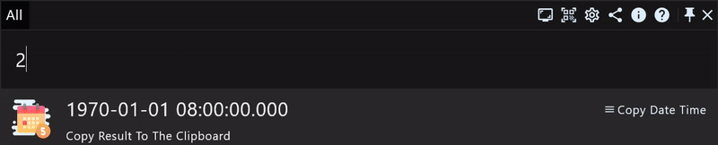

# 效率工具RunFlow完全手册之开发者篇

前面我们介绍了RunFlow的[基础功能](runflow_basic_point.md)和[进阶功能](runflow_advanced_point.md)，本文是专为开发者准备的开发者篇手册，一起来看看有哪些实用的功能吧。

### 执行命令

输入 `>` 进入命令专注模式（支持历史记录，执行常用命令变得更快捷）：

### 计算器

进制转换（二进制、八进制、十六进制分别以 `0b`、`0`、`0x` 开头）

位运算（与 `&`、或 `|`、异或 `^`、右移 `>>`、左移 `<<`）

### 日期计算器

当前时间戳（添加一个 `.` 参数可以停止实时时间，即：`now.`）

时间戳转时间（年、月、日、星期、小时、分钟、秒、毫秒分别用 `y`、`m`、`w`、`h`、`min`、`s`、`ms`）

偏移计算（`<` 向前偏移，`>` 向后偏移，示例：偏移到本周末 `now>w`，偏移到本月初 `now<m`，偏移到某天末 `2024-05-01>d`）

日期加减计算（示例：`100y+500h+999ms`、`2024-05-01+999min-3w`）

计算相差天数（示例：`2024-07-01-2024-01-01`、`20241231-20231231`）

> 输入时间支持格式：`yyyymmdd`、`yyyy-mm-dd`、`yyyyMMddHHmmss`、`yyyyMMdd HHmmss`、`yyyyMMddHHmmssSSS`、`yyyyMMdd HHmmssSSS`、`yyyy-MM-dd HH:mm:ss`、`yyyy-MM-dd HH:mm:ss.SSS`。

### 随机生成器

示例：`random upper 16` 随机16位数字和大写字母混合，`random lower 16` 随机16位数字和小写字母混合，`random abc 16` 随机16位大小写字母混合，`random int 100,999` 随机一个100到999的数字，`random color` 随机颜色。

### 开发者工具集

我们还提供一款开发者工具集插件，主要功能包括：代码命名风格转换、颜色解析、CRON表达式解析、Base32和Base64的编码和解码、Sha256和MD5加密、UUID生成以及大小写转换等等，[插件文档](https://myrest.top/zh-cn/store/plugin?id=top.myrest.myflow.developer)。

### 结语

本篇介绍了开发者常用的一些功能，如果您希望能开发插件，欢迎阅读我们的[插件开发指南](https://myrest.top/zh-cn/guide/myflow/plugin)。如果您是Java开发者，我们还准备了一篇Java开发者篇手册，欢迎阅读。
