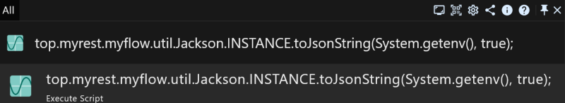
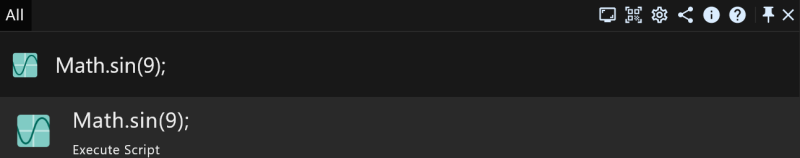

# 效率工具RunFlow完全手册之Java开发者篇

本文是为Java开发者写的手册，如果您不是Java开发者可以阅读我们的[开发者篇手册](runflow_developer_point.md)，当然如果您感兴趣也可以继续阅读。

> 输入 `qe` 进入QLExpress专注模式

### 获取系统信息

比如环境变量：`top.myrest.myflow.util.Jackson.INSTANCE.toJsonString(System.getenv(), true);`

### 执行Java代码

比如：`Math.sin(9);`

> 执行结果：`0.4121184852417566`。

### 验证方法
