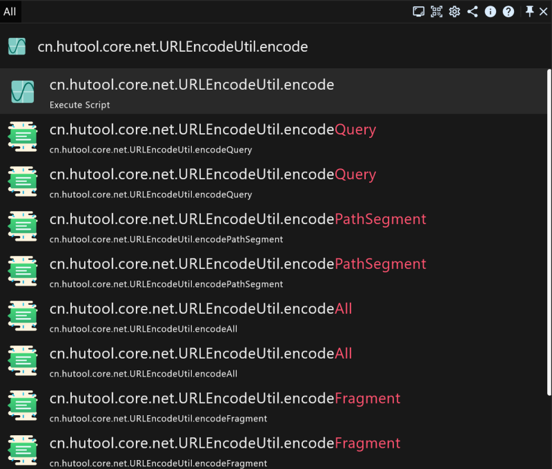

# 效率工具RunFlow完全手册之Java开发者篇

本文是为Java开发者写的手册，如果您不是Java开发者可以阅读我们的[开发者篇手册](runflow_developer_point.md)，当然如果您感兴趣也可以继续阅读。

> 输入 `qe` 进入QLExpress专注模式

### 执行Java代码

比如数学计算：`Math.sin(9);`

> 执行结果：`0.4121184852417566`。

比如读取系统环境变量：`top.myrest.myflow.util.Jackson.INSTANCE.toJsonString(System.getenv(), true);`

> 当然您也可以格式化为yaml：`top.myrest.myflow.util.Jackson.INSTANCE.toYamlString(System.getenv());`。

### 验证方法

有时候因为某些工具类的方法非常多，不知道到底该调用哪一个，需要验证一下方法的执行结果，比如：

### 结语

`QLExpress` 赋予了您在RunFlow运行时执行Java代码的能力，我们支持执行QLExpress语法的脚本文件，[了解QLExpress语法可以点击这里](https://github.com/alibaba/QLExpress)。同时我们还支持通过QLExpress来开发插件，[点击这里了解如何用QLExpress开发插件](https://myrest.top/zh-cn/guide/plugin#/general-plugin-guide/general_guide?id=%E9%80%9A%E7%94%A8%E6%8F%92%E4%BB%B6%E6%8C%87%E5%8D%97)。当然您使用Java来开发插件，将能获得更好的交互能力，[Java插件欢迎点这里阅读](https://myrest.top/zh-cn/guide/plugin#/jar-plugin-guide/jar_guide?id=jar%e6%8f%92%e4%bb%b6%e6%8c%87%e5%8d%97)。
