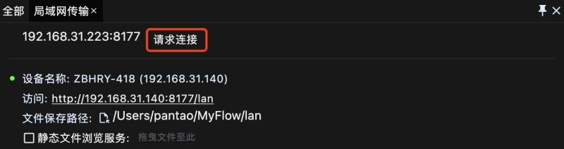
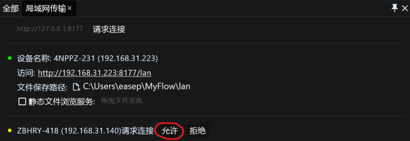
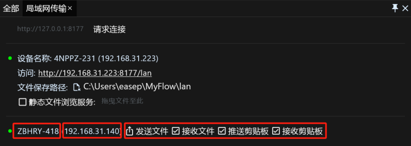
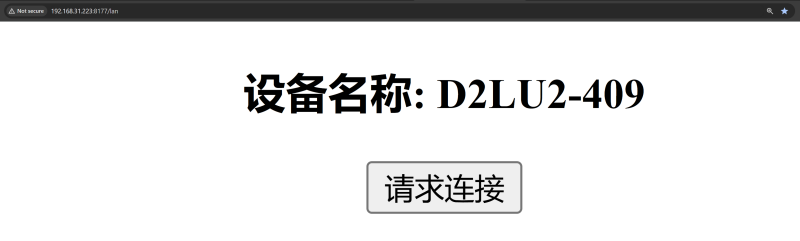
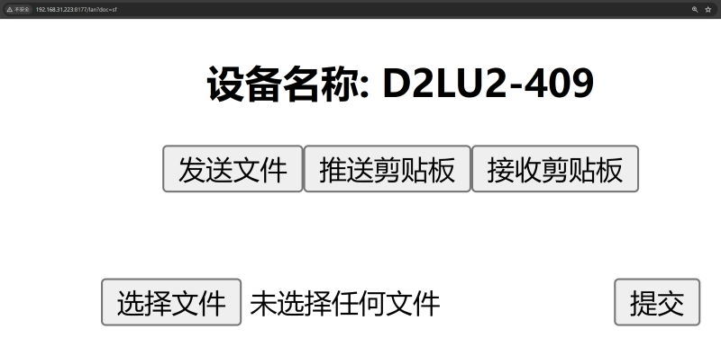

# 效率工具RunFlow完全手册之局域网传输篇

本篇将向您介绍如何使用RunFlow在局域网（又称内网）内传输文件，同步剪贴板，无论是家庭局域网还是办公室局域网，都能轻松搞定文件传输以及剪贴板同步，如果您还没有安装[RunFlow](https://myrest.top/zh-cn/myflow)，[可点这里去下载](https://myrest.top/zh-cn/myflow/download)。

> 为什么不推荐使用微信、QQ、钉钉、飞书等传输文件，要使用局域网传输呢？1. 私密，文件和剪贴板都是您的内网中传输，不会连接至任何公网服务器，保证您数据的隐私性和安全性；2. 快速，正是因为在内网中传输，无需互联网环境，所以可以让传输变得更迅速。

### 启用局域网传输

局域网传输工具默认是没有启用的，要启用它我们需要跳转到内置插件的设置页面，向下滚动会看到一个叫 `局域网传输` 的功能，勾选它以启用局域网传输。

> 如果您还不清楚如何打开我们的设置页面，可以先从我们的[基础篇](runflow_basic_point.md)开始了解。

成功启用 `局域网传输` 后，输入 `lan` 打开功能页，界面如下：

> 设备名称左侧的小绿点表示服务启动成功，否则表示启动失败，失败的原因很有可能是端口被占用，建议您在 `通用设置` 页面修改Http端口，并重启应用程序。

### 静态文件浏览服务

静态文件浏览服务可以理解为您共享了一个只读的文件，同一网络中的其他用户可以浏览和下载您共享的文件。要启用静态文件浏览服务，首先我们需要勾选它，并设置一个需要共享的文件（通常是一个文件夹），设置成功后我们可以看到一个可访问的链接，用浏览器打开链接就可以浏览和下载文件。

> 此方案可以实现向其他未安装RunFlow的设备传输文件，比如移动端或Linux设备。

### 建立连接以传输文件和剪贴板

要建立连接，我们首先需要知道对方设备的IPv4地址以及RunFlow启动HTTP服务的端口，在上方的第二张示例图片中，可以看到我们的界面已经展示了当前设备的IPv4地址及端口：`192.168.31.223:8177`。

设备A请求连接设备B：

设备B允许连接（当然您也可以拒绝）：

建立连接后我们可以看到对方的设备名称以及IPv4地址，并设置相应权限（默认全部开启，您可以自定义设置：1. 接收文件，是否接收来自该设备的文件；2. 推送剪贴板，当剪贴板发生变化时，是否向该设备推送剪贴板；3. 接收剪贴板，是否接收来自该设备推送的剪贴板）。

> 建立连接后，就可以愉快的传输文件以及同步剪贴板（文本、图片、文件都可以同步）啦。

### 与移动端、Web端以及其他未安装RunFlow的设备建立连接

在上方的第二张示例图片中，可以看到我们展示了一个可以访问的链接：`http://192.168.31.223:8177/lan` ，我们可以通过此链接使浏览器与RunFlow建立连接。

> 注意通过浏览器建立连接的一些限制：1. 无法接收文件；2. 无法监听剪贴板，所以推送剪贴板是您的主动行为；3. 无法接收来自该设备的剪贴板推送，但是可以查看该设备当前的剪贴板内容。

### 结语

本篇向您介绍了如何使用我们提供局域网传输用具来传输文件以及同步剪贴板，以满足各种隐私数据的传输。
