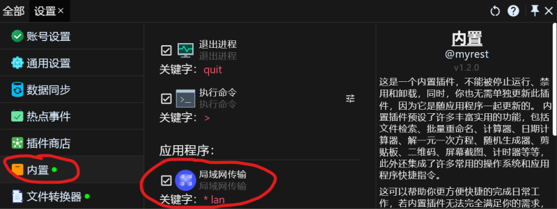
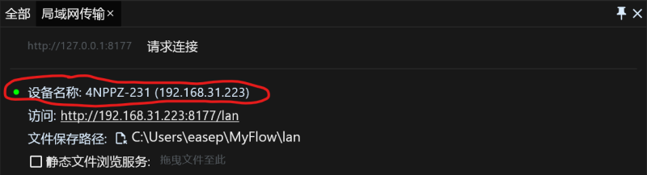
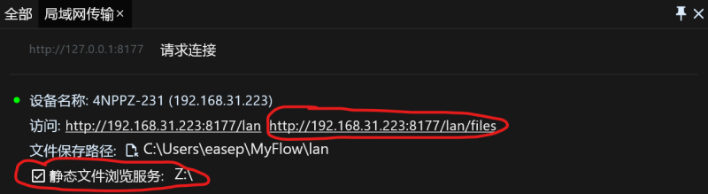
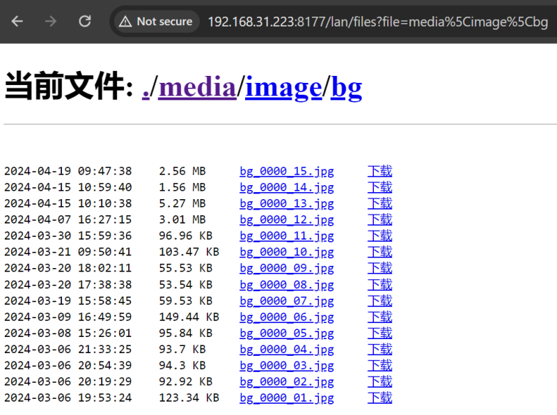

# 效率工具RunFlow完全手册之局域网传输篇

本篇将向您介绍如何使用RunFlow在局域网（又称内网）内传输文件，同步剪贴板，无论是家庭局域网还是办公室局域网，都能轻松搞定文件传输以及剪贴板同步，如果您还没有安装[RunFlow](https://myrest.top/zh-cn/myflow)，[可点这里去下载](https://myrest.top/zh-cn/myflow/download)。

> 为什么不推荐使用微信、QQ、钉钉、飞书等传输文件，要使用局域网传输呢？1. 私密，文件和剪贴板都是您的内网中传输，不会连接至任何公网服务器，保证您数据的隐私性和安全性；2. 快速，正是因为在内网中传输，无需互联网环境，所以可以让传输变得更迅速。

### 启用局域网传输

局域网传输工具默认是没有启用的，要启用它我们需要跳转到内置插件的设置页面，向下滚动会看到一个叫 `局域网传输` 的功能，勾选它以启用局域网传输。

> 如果您还不清楚如何打开我们的设置页面，可以先从我们的[基础篇](runflow_basic_point.md)开始了解。

成功启用 `局域网传输` 后，输入 `lan` 打开功能页，界面如下：

> 设备名称左侧的小绿点表示服务启动成功，否则表示启动失败，失败的原因很有可能是端口被占用，建议您在 `通用设置` 页面修改Http端口，并重启应用程序。

### 静态文件浏览服务

静态文件浏览服务可以理解为您共享了一个只读的文件，同一网络中的其他用户可以浏览和下载您共享的文件。要启用静态文件浏览服务，首先我们需要勾选它，并设置一个需要共享的文件（通常是一个文件夹），设置成功后我们可以看到一个可访问的链接，用浏览器打开链接就可以浏览和下载文件。

> 此方案可以实现向其他未安装RunFlow的设备传输文件，比如移动端或Linux设备。

