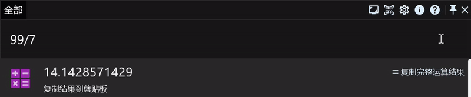
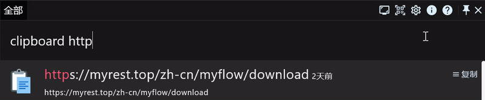
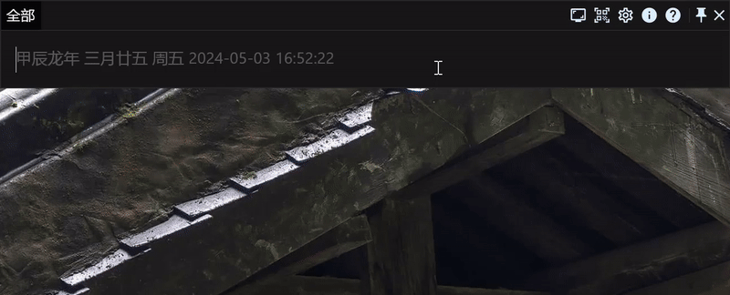
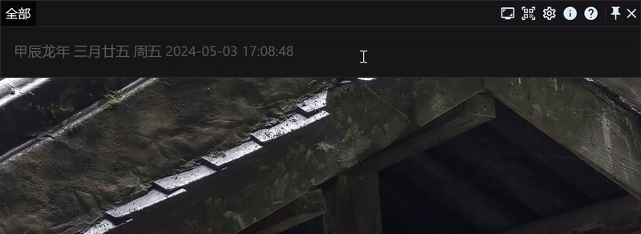

# 盘点效率工具RunFlow那些容易被忽略的功能

本文我们将带您了解RunFlow有哪些容易被忽略、但是又非常实用的功能。

> 还不了解RunFlow？[从这里开始了解](runflow_basic_point.md)。

### 固定工作窗口

> 您还可以通过双击 `Ctrl` 键来切换窗口固定状态，您也可以在 `热点事件` 设置页面自定义该快捷键。

### 预览菜单内容

### 用浏览器打开剪贴板复制的URL

### 多行输入

> 按 `Ctrl+Enter` 或 `Shift+Enter` 换行。

### 固定结果

> 固定的结果将始终显示在列表前面。

### 结语

本文盘点了那些容易被忽略但又非常实用的功能。
