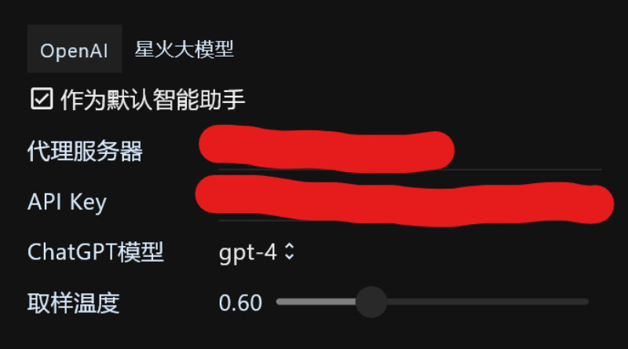

# 效率工具RunFlow插件手册之智能助手篇

本文将向您介绍RunFlow智能助手插件的详细使用教程，如果您还不了解RunFlow，建议您先阅读我们的[基础篇](runflow_basic_point.md)和[进阶篇](runflow_advanced_point.md)手册。

### 安装插件

打开 **设置** -> **插件商店** 安装 **智能助手** 插件。

### 使用讯飞星火大模型作为智能助手（可选）

首先申请API Key：[点这里去讯飞官网申请我们要用到的 `APPID`、`APISecret`、`APIKey`](https://console.xfyun.cn/services/bm35)。

打开智能助手设置：

配置  `APPID`、`APISecret`、`APIKey`：

> 使用讯飞星火翻译：[点这里购买讯飞星火翻译用量（有免费额度）](https://console.xfyun.cn/services/ots)。

### 使用OpenAI作为智能助手（可选）

申请API Key：[点这里去OpenAI官网申请API Key](https://platform.openai.com/account/api-keys)，我们也支持第三方代理的API Key（因为部分国家或地区无法使用OpenAI服务）。

打开智能助手设置：

配置 `API Key`：

> 如果您无法访问OpenAI服务或者是申请的第三方API Key，那么您可以设置代理服务器。

### 快速对话

输入想咨询智能助手的问题，然后输入关键字 `/` 即可：

> 讯飞星火大模型

> OpenAI ChatGPT

### 连续对话

输入关键字 `/` 进入智能助手专注模式，即可开启连续对话。

### 会话管理

输入关键字 `/` 进入智能助手专注模式，即可对会话进行管理，在工作窗口左侧可以搜索历史会话，查看历史对话（也可在历史对话基础继续会话），删除历史会话，点击加号按钮开启新会话。

### 结语

本文向您展示了如何使用我们提供的智能助手插件，更多插件欢迎来[插件商店](https://myrest.top/zh-cn/store/plugin)看看。
